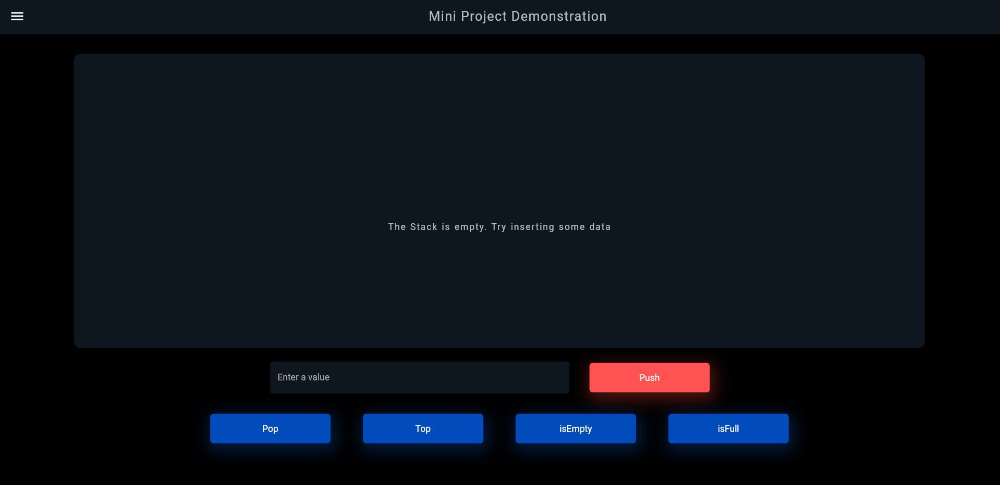

# Circular Stack by Linked List

This is the repo of my 3rd sem mini project where I implement a circular stack using linkedlist. It is done in dart programming language and flutter is used to create a beautiful UI interface.


## Run Locally on your PC

Clone the project

```dart
  git clone https://github.com/saugatadh/circularstack_miniproject.git
```

Go to the project directory

```dart
  cd circularstack_miniproject
```

Install dependencies

```dart
  flutter pub get
```

Start the server

```dart
  flutter run
```

  
## Screenshots




## Usage/Examples

Defining the stack size
```dart
  int MAX_STACK_SIZE = 7;
```
creating Node
```dart
  class Node {
   
	    int data;
	    Node next;
}
```
Push element to stack
```dart
     void push( int value)
         {
            counter += 1;
            Node temp = new Node();
            temp.data = value;
              
            if (isEmpty()){
              temp.next = temp;
              tail = temp;
            }else if(isFull()){
                print("Stack is overflowed");
                counter -= 1;
            }else{
                  temp.next = tail.next;
                  tail.next = temp;
            }

	
      }    
```
Pop element from stack
```dart
         int pop()
              {
              int value; 
              counter -= 1;
              if (isEmpty()) {
                print("Stack is empty");
                return 0;
              }   
              if (tail.next == tail) {
                    value = tail.data;
                    tail = null;
                    
              }
              else 
              {
                Node temp = tail.next;
                value = temp.data;
                tail.next = temp.next;
              
              }

              return value;
            }
```
check is stack empty

```dart
     bool isEmpty(){
          if(tail==null){
            return true;
          }else{
            return false;
          }
      }
```
check is stack full

```dart
     bool isFull(){
           if (counter > MAX_STACK_SIZE)
          return true;
        else
          return false;
      }
```
get top element of stack
```dart
   int top(){
	        return tail.next.data;
    }
```
  
